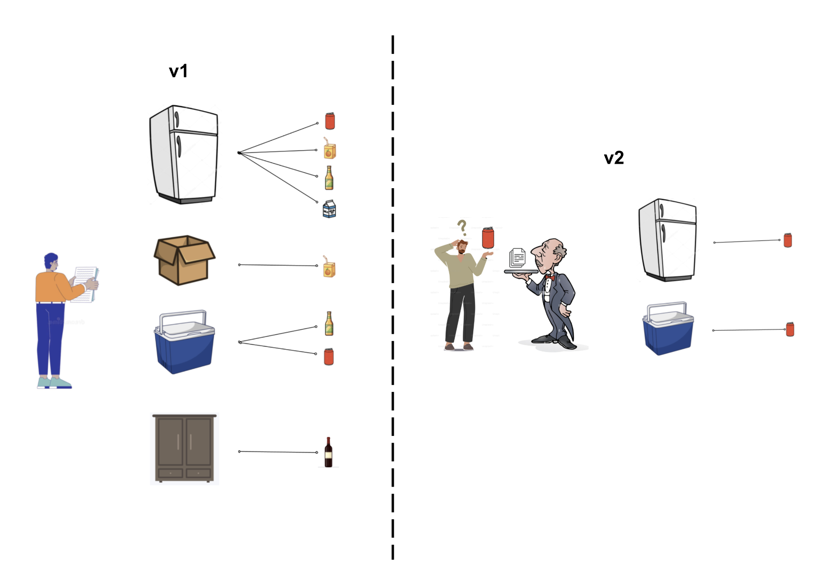

# Data API v2 proposal

This application is a mockup designed to explore the data API using a different organizational schema that asserts the primacy of the variable (as opposed to the coverage) in API requests. New features in this application include a data catalog, an `about` endpoint that describes data resources, and a `data` endpoint used to request data.

## Why v2?
Our current endpoint roots (table below) are a mix of dataset titles (`cmip6`, `alfresco`, `gipl`...), variable names (`permafrost`, `temperature`, `beetles`, ...), spatial units (`boundary`, `places`, `point`, ...), applications (`eds`, `ncr`, ...), etc. What at first glance appears as a hierarchical organizational scheme is actually not. Current service categories are really just synonyms for their data source (usually a Rasdaman coverage) and similar variable data can be found under multiple service categories. Also, in general, request parameterization is inconsistent. Request parameters are specified via the route URL, but sometimes they are selected using additional `GET` parameters. 

Reconfiguring the API to be more internally consistent has many potential benefits, including:
- ability to implement universal functions that operate identically in every service category
- reduction of complexity in documentation if all service categories function in a uniform way
- implementation of a proper testing suite
- less friction when adding new data & its corresponding documentation
- being prepared to use the API in an AI/LLM context

#### Table of v1 endpoints by route
|route|endpoint|
|--------|-------|
|`boundary.py`|`boundary/area/<var_id>`|
|`cmip6.py`|`cmip6/point/<lat>/<lon>`|
|`cmip6.py`|`cmip6/point/<lat>/<lon>/<start_year>/<end_year>`|
|`hydrology.py`|`hydrology/point/<lat>/<lon>`|
|`hydrology.py`|`eds/hydrology/<lat>/<lon>`|
|`hydrology.py`|`eds/hydrology/point/<lat>/<lon>`|
|`snow.py`|`eds/snow/<lat>/<lon>`|
|`snow.py`|`snow/snowfallequivalent/<lat>/<lon>`|
|`demographics.py`|`demographics/<community>`|
|`fire.py`|`fire/point/<lat>/<lon>`|
|`vectordata.py`|`places/search/<lat>/<lon>`|
|`vectordata.py`|`places/<type>`|
|`elevation.py`|`elevation/point/<lat>/<lon>`|
|`elevation.py`|`elevation/area/<var_id>`|
|`indicators.py`|`indicators/cmip6/point/<lat>/<lon>`|
|`indicators.py`|`indicators/base/point/<lat>/<lon>`|
|`indicators.py`|`indicators/base/area/<var_id>`|
|`degree_days.py`|`degree_days/<var_ep>/<lat>/<lon>`|
|`degree_days.py`|`degree_days/<var_ep>/<lat>/<lon>/<start_year>/<end_year>`|
|`degree_days.py`|`eds/degree_days/<var_ep>/<lat>/<lon>`|
|`ecoregions.py`|`ecoregions/point/<lat>/<lon>`|
|`permafrost.py`|`permafrost/point/gipl/<lat>/<lon>`|
|`permafrost.py`|`permafrost/point/gipl/<lat>/<lon>/<start_year>/<end_year>`|
|`permafrost.py`|`permafrost/point/<lat>/<lon>`|
|`permafrost.py`|`eds/permafrost/<lat>/<lon>`|
|`permafrost.py`|`ncr/permafrost/point/<lat>/<lon>`|
|`beetles.py`|`beetles/point/<lat>/<lon>`|
|`beetles.py`|`beetles/area/<var_id>`|
|`landfastice.py`|`landfastice/point/<lat>/<lon>`|
|`wet_days_per_year.py`|`wet_days_per_year/<horp>/point/<lat>/<lon>`|
|`wet_days_per_year.py`|`wet_days_per_year/<horp>/point/<lat>/<lon>/<start_year>/<end_year>`|
|`wet_days_per_year.py`|`mmm/wet_days_per_year/<horp>/point/<lat>/<lon>`|
|`wet_days_per_year.py`|`mmm/wet_days_per_year/<horp>/point/<lat>/<lon>/<start_year>/<end_year>`|
|`wet_days_per_year.py`|`eds/wet_days_per_year/point/<lat>/<lon>`|
|`eds.py`|`eds/all/<lat>/<lon>`|
|`seaice.py`|`seaice/point/<lat>/<lon>`|
|`taspr.py`|`eds/temperature/<lat>/<lon>`|
|`taspr.py`|`eds/precipitation/<lat>/<lon>`|
|`taspr.py`|`<var_ep>/<lat>/<lon>`|
|`taspr.py`|`<var_ep>/<month>/<lat>/<lon>`|
|`taspr.py`|`<var_ep>/<lat>/<lon>/<start_year>/<end_year>`|
|`taspr.py`|`<var_ep>/<month>/<lat>/<lon>/<start_year>/<end_year>`|
|`taspr.py`|`tas2km/point/<lat>/<lon>`|
|`taspr.py`|`temperature/point/<lat>/<lon>`|
|`taspr.py`|`precipitation/point/<lat>/<lon>`|
|`taspr.py`|`taspr/point/<lat>/<lon>`|
|`taspr.py`|`temperature/area/<var_id>`|
|`taspr.py`|`precipitation/area/<var_id>`|
|`taspr.py`|`taspr/area/<var_id>`|
|`taspr.py`|`precipitation/frequency/point/<lat>/<lon>`|
|`alfresco.py`|`alfresco/<var_ep>/local/<lat>/<lon>`|
|`alfresco.py`|`alfresco/<var_ep>/area/<var_id>`|

### The house party metaphor

To explain the difference between v1 and the proposed v2, let's have some house parties. Imagine that we are the host, inviting some guests over for a house party...

#### v1 party
>Host: _"I got all the beverages, and put them in easily accessible places for guests to find. I'll make documents describing where to find all the different beverages, and explicit instructions on how to get them. When the guests arrive, they can review all the documents and go find the beverages they want."_

>Guest: _“I want soda...but first I need to read about all the places where soda could be, and read about the different flavors of soda available. I must read well, or I might not know about all the places that have soda, or I might not know about all the flavors that are available. I’ll make trips to each place to get the exact soda flavors I want.”_

#### v2 party
>Guest: _“I want soda...I'll simply ask the host for soda.”_

>Host: _“Here is a document describing the exact places I have soda, and the exact flavors I have available in each place. Please follow these explicit instructions to get exactly the soda you want.”_

>Guest: _“Using this specific soda guide, I’ll make trips to each place to get the soda that I want.”_

This difference may seem subtle, but represents a large change in the user experience and a large change in our data management. In v1, we give the guest a large map or menu and hope they find the soda they want. In v2, we let the user ask for the thing they want (soda) and then tell them what soda we have.  




## API Data Catalog
Central to this proposed v2 scheme is an API data catalog (see a mockup in `catalog.py`). This could take many formats, but is essentially an authoritative record of all API-relevant data holdings that will be populated using a standalone processing pipeline (TBD). The level of detail should be granular enough to allow validation of any allowable request, but not so granular as to contain any actual data.

The highest levels of organization would be **service category** and **variable**. For each variable, metadata about available sources will be populated directly from the source data (Rasdaman, GeoServer, etc.) This is almost the reverse of the current organization schema, where service categories are  synonyms for data source and similar variable data can be found under multiple service categories. (This is situation is represented in the house party metaphor by the soda being found in both the fridge and cooler.) Also, metadata about sources is currently populated manually in HTML documentation or accessed on-the-fly via coverage metadata requests. There is currently no programmatically generated, authoritative source.

By asserting the primacy of the variable, this structure can decouple 1:1 relationships between endpoints and Rasdaman coverages or GeoServer layers on the backend. This could increase complexity in retrieving and packaging the data return, and could also highlight inconsistencies in frequency, spatial and temporal domains, etc. between different data sources. The data catalog is intended to manage the complexity in these cases by providing a record on what is and is not available across all holdings.

A highly structured data catalog could simplify the codebase by promoting the use of API-wide functions to:
- validate request parameters presence / absence against service category requirements
- validate requests parameter values against ranges of possible values in source
- generate specific error messages relating to parameters (e.g., "your request was missing required parameter _X_, which needs to be one of _X, Y,_ or _Z_.")

The data catalog will also be useful to:
- add more data sources to our holdings without revising the main API codebase
- store source citations & other source metadata for use in the HTML documentation, to potentially build documentation pages programatically instead of manually
- allow programmatic queries of data holdings without requesting actual data (i.e., audit the API)

The mockup `catalog.py` is in the format below (more or less).

```
data_catalog = {
    <service_category>: {
        "variables": {
            <var_id>: {
                "name": <var_long_name>,
                "source": {
                    <source_id>: {
                        "request_parameters": {
                            "required": {
                                <parameter>: <parameter_description>,
                            "optional": {
                                <parameter>: <parameter_description>,                                },
                            },
                        },
                        "metadata": 
                            {<source_metadata>},
                    ...},
                ...},
            ...},
        ...},
    ...},
}
```


## v2 Service Categories
Endpoints that serve variable data are organized under 5 service categories: `atmosphere`, `hydrosphere`, `biosphere`, `cryosphere`, and `anthroposphere`. Endpoints that serve geospatial data are organized under the `geospatial` service category. These categories are intended to be hierarchical and immutable (i.e., able to incorporate variables from any new datasets without adding new categories).

### Proposed hierarchy:

>- **Geospatial**
>   - Point, Polygon, Line, ...
>- **Atmosphere**
>   - Air temperature, Cloud cover, ...
>- **Biosphere**
>   - Land Cover, Flammability, Spruce Beetles, ...
>- **Hydrosphere**
>   - Precipitation, Runoff, Snow, ...
>- **Cryosphere**
>   - Sea Ice, Landfast Sea Ice, ...
>- **Anthroposphere**
>   - Demographics, ...

Querying the root `about` along with the service category will return the catalog entries for all variables housed under that category, and a brief list of data sources for each variable. This is intended as a brief snapshot of data holdings for a given service category. Querying the `about` root for one or more variables / geometry types using `GET` parameters will return the catalog entries for those variables, which includes detailed information including required `GET` parameters for each source and metadata to help with creating valid requests.

To request data, use the `data` root and include the variable / geometry type, and required `GET` parameters (e.g. source, location...) as defined in the catalog. (Note that this mockup allows for request of multiple data variables, but does not yet allow requesting multiple sources. )

## Run the mockup application
### Setup 

Activate the usual `conda` environment for the data API.

`pipenv install`

Set `flask` application environment variables:

`export FLASK_APP=application.py`

`export FLASK_DEBUG=True`

Run the application:

`pipenv run flask run`

### Test Queries
>Example service category about query, which returns general information:
>- http://localhost:5000/about/atmosphere
>- http://localhost:5000/about/geospatial/
>
>Example service category & variable / geometry type about query, which returns detailed information:
>- http://localhost:5000/about/atmosphere?vars=t2
>- http://localhost:5000/about/geospatial/?geom_type=polygon
>
>Example data query for air temperature from a specific source and location:
>- http://localhost:5000/data/atmosphere?vars=t2&source=CMIP6&loc=(64.8,-147.7)
>
>Example data query for geospatial features:
>- http://localhost:5000/data/geospatial/?geom_type=polygon&category=watersheds&source=NHD_HUC6&loc=(64.8,-147.7)


